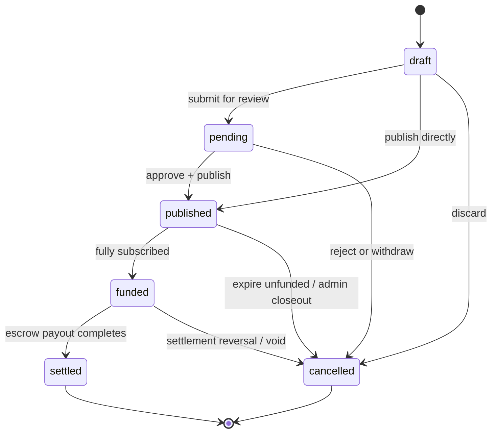

# Invoice Lifecycle

This service models invoices as a small state machine:

## States

| State | Meaning | Actor | Guard | Investor / escrow impact |
| --- | --- | --- | --- | --- |
| `draft` | Editable invoice not yet offered to investors. | Seller | None beyond ownership. | No commitments or escrow activity. |
| `pending` | Transitional review state before publication. | Seller or workflow | Must still be valid and owned by the seller. | Still no investor commitments. |
| `published` | Invoice is live and fundable. | Seller / admin workflow | `validateInvoiceForPublish()` must pass. | Investors may commit; Soroban escrow draft can be prepared when funding starts. |
| `funded` | Funding target reached and capital is locked for settlement. | Funding workflow | Total commitments meet or exceed the net amount. | Investor commitments are recorded; escrow funding is tracked for reconciliation. |
| `settled` | Invoice repayment completed. | Settlement workflow | Escrow / repayment verification must succeed. | Investors realize returns and the transaction becomes terminal. |
| `cancelled` | Terminal failure or closeout state. | Seller, admin, or workflow | Only valid from non-terminal states. | No new commitments; any unfunded published invoice is closed out here instead of introducing a separate status. |

## Notes

- `draft -> published` is allowed directly; `pending` is optional.
- `published -> cancelled` is the terminal path for an unfunded or abandoned invoice.
- `funded -> settled` is the normal success path after repayment is confirmed.
- `settled` and `cancelled` are terminal states.
